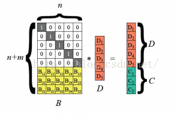
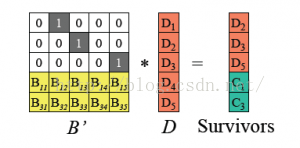
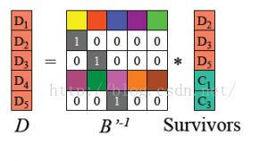
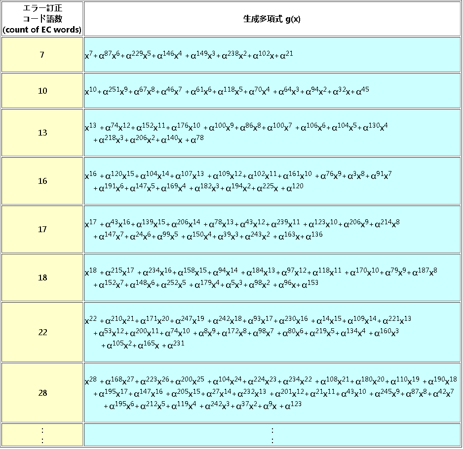
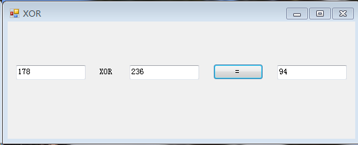

# 计算纠错码#

QR码的纠错等级指允许符号在不丢失数据的情况下承受损坏的程度：

- 级别L：可以纠正大约7％或更少的错误。

- 级别M：可以纠正大约15％或更少的错误。

- 级别Q：可以纠正大约25％或更少的错误。

- 级别H：可以纠正大约30％或更少的错误。

纠错码字分为两种错误码字：

- 即拒绝错误（位置已知的错误码字）（可以纠正代码字位置未知的错误）

	拒绝错误未被扫描或解码让它成为不可能的符号字符 

- 赋值错误是错误解码的符号字符。

	因为它是一个矩阵类型的符号系统，模块从暗到亮或从亮到暗的转换问题，尽管它作为符号字符有效，但它导致解码为不同的代码字。在其数据中为了纠正诸如2的分配错误，需要两个纠错码字。

可校正的拒绝误差和替换误差的数量可以通过以下等式获得

		e + 2t  ≤ d - p
	
		在这里，
	
		e：拒绝错误的数量
	
		t：替换错误数
	
		d：纠错码字数
	
		p：可防止解码错误代码字数

在上述等式中，1-L类型的  p = 3，在1-M型和2-L型  p = 2,1-Q型，1-H型及3-L型的符号，P = 1 ，  对于其他情况  ，p = 0。当p > 0时，它用作错误检测码字，如果错误数量超过纠错能力，则解码错误。

例如，在2-L类型中，当代码字的总和为44时，其中34是数据代码字，10是纠错码字。从后面的纠错对照表中 ，可以看出e = 0时，纠错能力是4。

代入上述表达式：0+（2×4）= 10 -2，在该等式中，四个纠错码需要八个纠错码字，剩余的两个纠错码字是除此之外，还可以检测到其他错误（未更正），如果错误超过4个，则无法解码。

## 准备工作

二维码的纠错码主要是根据里德-所罗门纠错算法实现的，想理解或者研究里德-所罗门算法需要先了解一下线性分组码的监督矩阵、生成矩阵、汉明距等许多相关概念，下面也有相关推荐资料。另外，我们是将数据分块，以bytes为单位保持数据，但在里德-所罗门算法里的实现都是以0、 1矩阵表示，所以要满足二进制的四则运算进行实际数据的计算，需要用到伽罗瓦域Galois Field相关知识，将数据映射到0-255的2的幂表示。这些知识太多，也比较复杂，不是可以一下子说的清的。

这里推荐一些资料，主要还是自己动手去查

[wiki -- Reed–Solomon](https://en.wikiversity.org/wiki/Reed%E2%80%93Solomon_codes_for_coders)

[BCH编码相关概念](https://wenku.baidu.com/view/f9ed1507f7ec4afe04a1df70.html?tdsourcetag=s_pcqq_aiomsg&qq-pf-to=pcqq.c2c)

[线性分组码](../doc/信息论与编码原理线性分组码.ppt)

### Reed Solomon原理简单介绍（摘自网易视频云技术分享）

[英文版快速入门](./2013-02-11-FAST-Tutorial.pdf)

- 编码原理

	RS编码以byte为编码和解码单位，大的数据块拆分到字长为8的byte，然后对byte进行编解码。所以数据块的编码原理与byte编码原理没什么差别，为论述方便，后文中变量Di, Ci将代表一个byte。

	

	首先，把输入数据视为向量D=(D1，D2，…, Dn）, 编码后数据视为向量（D1, D2,…, Dn, C1, C2,.., Cm)，RS编码可视为如图所示矩阵运算。下图最左边是编码矩阵，矩阵上部是单位阵（n行n列），下边是vandermonde矩阵B(m行n列),第i行，第j列的原数值为j^(i-1)。之所以采用vandermonde矩阵的原因是， RS数据恢复算法要求编码矩阵任意n*n子矩阵可逆。

- 数据恢复

	RS最多能容忍m个删除错误。数据恢复原理的过程如下：

	（1）从编码矩阵中删去丢失数据块和丢失编码块对应行。假设D1、D4、C2丢失，根据图1所示RS编码运算等式，我们得到如下B’以及等式。
	
	

	
	（2）由于B‘是可逆的，两边乘上B’逆矩阵。
		
	
	
	（3）得到如下原始数据D的计算公式
			
	
	
	（4）对D重新编码，得到丢失的校验码矩阵求逆采用高斯消元法，需要进行实数加减乘除四则运算，无法作用于字长为w的二进制数据。为了解决这个问题， RS采用伽罗华群GF（2^w)中定义的四则运算法则。 GF(2^w）域有2^w个值，每个值都对应一个低于w次的多项式，这样域上的四则运算就转换为多项式空间的运算[2]。 GF(2^w)域中的加法就是XOR，乘法比较特殊，需要维护两个大小为2^w -1的表格: log表gflog，反log表gfilog。

Reed Solomon将所有的运算归结到有限域中，即通常说的珈罗华域。充分利用了有限域的封闭性。而且我们也不是直接求出商是多少，而是间接地解出错误发生的位置和值。有了这些信息，我们就可以实现纠错了。但是其原理可以简化S=AB+C，A、B、S-C都是有限域范围内的成员，AB=S-C代表在可容忍的出错范围内，我们只需要知道A或者B（即上面矩阵的B‘），就可以通过除以A或者B得到B或A，也就完成编码。

### Reed Solomon计算纠错字举例

对QR代码字的多项式进行算术模2和算术模100011101（系数为2^8伽罗瓦域的本原多项式 x^8 + X^4 + X^3 + X^2 + 2 表示为 100011101）。数据代码字是多项式项的系数，最高阶项为第一个数据代码字，最低阶项为最后一个数据字。纠错码字是通过将数据码字除以在纠错检测和校正中使用的生成多项式g (x)而获得的余数。该余数的最上位系数是最初的纠错码字，而零次方的系数是最终纠错码字，并成为RS块中的最终代码字。

- 首先，假设使用已经编码并转换成8位的示例数据 32 65 205 69 41 220 46 128 236，版本1，纠错等级为H。

	 查找纠错对照表，在示例数据中，1-H中的RS块编号为1，我们不需要分隔。

	

- 接下来，在纠错对照表中示例数据纠错码字的数量是17，我们查找生成多项式表选择g（x）。

		G（X）= X^17 + α^43*X^16 + α^139*X^15 + α^206*X^14 + α^78*X^13 +
				 α^43*X^12 + α^239*X^11 + α^123*X^10 + α^206*X^9 + 
				 α^214*X^8 + α^147*X^7 + α^24*X^6 + α^99*X^5 + α^150*X^4 + 
				 α^39*X^3 + α^243*X^2 + α^163*X + α^136 

	

	其中α是GF（2^8）伽罗华域的特殊元素，域内所有非零元素均可由α的幂次表示，其中α的幂次所表示的值可以从下面链接查询：

 	[α幂次的整数对照表](./images/EccSpec/jialuohuaTable.htm)

- 现在要计算rs码，其生成方式可以参考[wiki -- Reed–Solomon](https://en.wikiversity.org/wiki/Reed%E2%80%93Solomon_codes_for_coders)，生成方式有很多种，我们只介绍使用其中的长除法，系数是数据码字的多项式f（x）除以g（x）。

	因为生成多项式从x^17开始，在算术运算中我们是被除数后面补零，在这里我们从x^17开始，以示例数据从后为系数，x的幂依次递增，得到

		f（x）= 32*x^25 + 65 * x^24 + 205*x^23 + 69*x^22 + 41*x^21 + 
				 220*x^20 + 46*x^19 + 128*x^18 + 236*x^17 <---式（1）

	f（x）中的前导项系数为32，对于32在[α幂次的整数对照表](http://www.swetake.com/qrcode/qr_table4.html)中是α^ 5，我们用生成多项式*（α^5）* X^8约掉f（x）的最高项

		 G（X）*（α^5）* X^8
		
		=α^5*X^25 + α^5 *α^43 * X^24 + α^5 *α^139 * X^23 +  
				 α^5 *α^206 * x^22 + α^5 *α^78 * X^21 ..... 
		
		=α^5 * X^25 + α^48 * X^24 + α^144 * X^23 + 
				 α^211 * X^22 + α^83 * X^21 + 
				 α^48 * X^20 + α^244 * X^19 + α^128 * X^18+ 
				 α^211 * X^17 + α^219 * X^16 + α^152 * X^15+ 
				 α^29 * X^14 + α^104 * X^13 + α^155 * X^15+ 
				 α^44 * X^11 + α^248 * X^10 + α^168 * X^9 + α^141 * X^8
		
		= 32x^25 + 70x^24 + 168x^23 + 178x^22 + 187x^21 ..... <---式（2）
			
	

	然后计算式（1）和式（2）每个同阶系统的异或运算，可以自己手写一个计算工具方便计算。最后计算结果如下：

		f（x）'= 7*x^24 + 101*x^23 + 247*x^22 + 146*x^21 + 
				154*x^20 + 212*x^19 + 5*x^18 + 94*x^17 + 
				86*x^16 + 73*x^15 + 48*x^14 + 13*x^13 + 114*x^12 +  
				238*x^11 + 27*x^10 + 252*x^9 + 21*x^8 
	
	在重复计算结束之前，我们重复相同的逻辑。接下来，对于7是α^198，我们使用g（x）* α^198 * x^7.如果α的指数超过255，那么我们使用α^255 = 1。

	

- 最后，减去这些素多项式，我们可以得到剩下的R（x）。 

		R（x）= 42X^ 16 + 159x^ 15 + 74X^ 14 + 
				 221x^ 13 + 244x^ 12 + 169x^ 11 +  
				239x^ 10 + 150x^9 + 138X^ 8 +  
				70X^ 7 + 237x^ 6 + 85X^ 5 +  
				224X^ 4 + 96X^ 3 + 74X^ 2+ 219x +61 

	所以在剩余式之前加上示例数据，我们可以得到编码数据： 

		32 65 205 69 41 220 46 128 236    42 159 74 221 244 169 239 150 138 70 237 85 224 96 74 219 61
	
	当然，有编码就有解码，解码过程比编码过程复杂的多，也不在涉及范围，感兴趣的可以自己去搜索资料看看，很多都有Python版的代码。

### 实际项目RS编码与实现

在有前面的基础上，后面的实现过程就相对好理解点了。

- 获取RS纠错码结构化信息

	在不同版本号、纠错等级下，需要将数据分为两个组，每个组划分不同的数据块，可查找上面已经介绍的纠错对照表，代码中将这些信息保存在spec数组中，每个元素的含义见代码注释：

		void mQrspec::QRspec_getEccSpec(int version, QRecLevel level, int spec[5])
		{
			int b1, b2;
			int data, ecc;
		
			b1 = eccTable[version][level][0];	// 第一组需要划分纠错块的个数
			b2 = eccTable[version][level][1];	// 第二组需要划分的纠错块个数
			data = QRspec_getDataLength(version, level);	// 上一节的编码数据字节数
			ecc  = QRspec_getECCLength(version, level);	// 纠错码字节数
		
			if(b2 == 0) {
				spec[0] = b1;
				spec[1] = data / b1;
				spec[2] = ecc / b1;
				spec[3] = spec[4] = 0;
			} else {
				spec[0] = b1;				// ...
				spec[1] = data / (b1 + b2);	// 第一组每个块中编码数据长度
				spec[2] = ecc  / (b1 + b2);	//	纠错字数据长度
				spec[3] = b2;				// ...
				spec[4] = spec[1] + 1;		//	第二组每个块中编码数据长度
			}
		}

- 数据保存格式方式

	我们主要想获取纠错码，并按标准进行块划分，所以，每个块的编码数据都存放在RSblock类型的指针中，在后面进行结构化编码时或遍历这个指针

		typedef struct {
			int dataLength;
			unsigned char *data;
			int eccLength;
			unsigned char *ecc;
		} RSblock;

- 初始化控制Reed-Solomon编码生成模块

		/**
		 * Reed-Solomon codec control block
		 */
		struct _RS {
			int mm;              /* Bits per symbol */
			int nn;              /* Symbols per block (= (1<<mm)-1) */
			data_t *alpha_to;     /* log lookup table */
			data_t *index_of;     /* 反过来根据值查找α次幂 */
			data_t *genpoly;      /* Generator polynomial */
			int nroots;     /* Number of generator roots = number of parity symbols */
			int fcr;        /* First consecutive root, index form */
			int prim;       /* Primitive element, index form */
			int iprim;      /* prim-th root of 1, index form */
			int pad;        /* Padding bytes in shortened block */
			int gfpoly;
			struct _RS *next;
		};

	Reed-Solomon编码生成控制器，主要记录每个数据所用的比特位数，每个块最多能有多少个数据，前面介绍的α次幂所对应的值查询表与反过来根据值查找幂表，产生伽罗华域的多项式，rs生成多项式等，后面的这几个初始化过程我没有看懂，还是跳过吧~初始化过程调用init_rs_char函数。

		/* Initialize a Reed-Solomon codec
		 * symsize = symbol size, bits
		 * gfpoly = Field generator polynomial coefficients
		 * fcr = first root of RS code generator polynomial, index form
		 * prim = primitive element to generate polynomial roots
		 * nroots = RS code generator polynomial degree (number of roots)
		 * pad = padding bytes at front of shortened block
		 */
		
		/* Common code for intializing a Reed-Solomon control block (char or int symbols)
		 * Copyright 2004 Phil Karn, KA9Q
		 * May be used under the terms of the GNU Lesser General Public License (LGPL) 
		 */

		RS *init_rs_char(int symsize, int gfpoly, int fcr, int prim, int nroots, int pad);
		
	因为这个生成的RS是静态数据，每初始化一次就保存到RS结构的链表里面，所以下一次调用时就没必要再重新初始化了。

- 编码RS纠错码

	前面得到纠错码的实现如下：

		void mRscode::encode_rs_char(RS *rs, const data_t *data, data_t *parity)
		{
		  int i, j;
		  data_t feedback;
		
		  memset(parity,0,NROOTS*sizeof(data_t));
		
		  for(i=0;i<NN-NROOTS-PAD;i++){
		    feedback = INDEX_OF[data[i] ^ parity[0]];
		    if(feedback != A0){      /* feedback term is non-zero */
		#ifdef UNNORMALIZED
		      /* This line is unnecessary when GENPOLY[NROOTS] is unity, as it must
		       * always be for the polynomials constructed by init_rs()
		       */
		      feedback = MODNN(NN - GENPOLY[NROOTS] + feedback);
		#endif
		      for(j=1;j<NROOTS;j++)
			parity[j] ^= ALPHA_TO[MODNN(feedback + GENPOLY[NROOTS-j])];
		    }
		    /* Shift */
		    memmove(&parity[0],&parity[1],sizeof(data_t)*(NROOTS-1));
		    if(feedback != A0)
		      parity[NROOTS-1] = ALPHA_TO[MODNN(feedback + GENPOLY[0])];
		    else
		      parity[NROOTS-1] = 0;
		  }
		}

	我们整个项目的实际例“abcdefg!!!!!!!@#$%hijk123131lmn”字符串编码后与生成的纠错码如下：
	

## 前后过程链接

- 上一过程

	[字符串数据编码](./CodeGenerator.md)

- 下一过程

	[编码数据结构化填充](./DataFill.md)

- 总览

	[README](../README.md)

